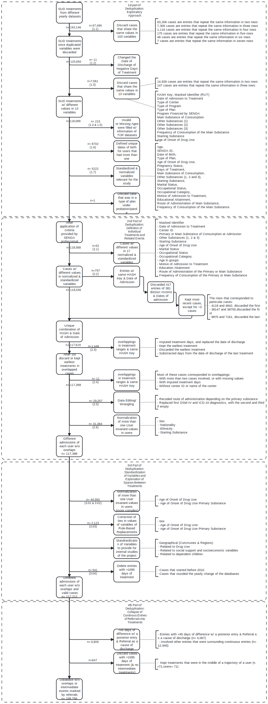

# SISTRAT Datasets

This page is composed by the following main topics:

1.  [**Encryption of RUTs and Generation of HASHs**](Encript.html)

2.  [**Data Preparation and Standardization of C1**](Data_prep_C1)

-   2.1. [Preliminary Results for SER 2020](SER_Stata.html)

-   2.2. [Deduplication of C1](Duplicates)

-   2.3. [Deduplication of C1, Part 2](Duplicates2)

-   2.4. [Deduplication of C1, Part 3](Duplicates3)

-   2.5. [Deduplication of C1, Part 4](Duplicates4)

-   2.6. [Presentation of Preliminary Processes and Descriptive Data to Institutions](Presentación_jun_2020)

-   2.7. [Descriptive Glimpse of the Database](Desc)

-   2.8. [Codebook of C1](codebook)

3.  **Associations & Analytic Exercises**

3a.1. **Ambulatory or residential? a multi-state analysis of treatments for substance use disorders- Main analyses**

-   3a.1.1.a [Step 1: Imputation, Matching & set the database](Matching_Process1_APR_22)

-   3a.1.1.b [Stata, Step 1: Set the database, AJ estimates](Matching_Process0_stata_OCT_22)

-   3a.1.2.b [Stata, Step 2: Compute Transition Probabilities](Matching_Process1_stata_OCT_22)

-   3a.1.3.b [Stata, Step 3: Summarise estimates in tables and export](Matching_Process2_stata_OCT_22)

-   3a.1.4.b [Stata, Step 4: Plot probabilities and differences](Matching_Process3_stata_OCT_22)

-   3a.1.5.b [Stata, Step 5: CI 83% transitions 3 & 4](Matching_Process4_stata_APR_22)

-   3a.1.6.b [Stata, Step 6: Predicted survival curves for stratified and clustered cox model with time-varying coefficients](Matching_Process5_stata_APR_22)

-   3a.1.7.a [Step 5: Sensitivity analyses, Sankey, Transition Trees](Matching_Process5_SEP_22)

-   3a.1.8.a [Figures to paper](Figures_stata_OCT_22)

3a.2. **Ambulatory or residential? a multi-state analysis of treatments for substance use disorders- Supplemental analyses**

-   3a.2.0.a [Step 1: Explore relationships, Matching, set multistate framework, check PH](Matching_Process1_APR_22)

-   3a.2.1.b [Stata, Step 1: Set the database, AJ estimates (complete-cases)](Matching_Process0_stata_OCT_22_cc)

-   3a.2.2.b [Stata, Step 2: Compute transition probabilities (complete-cases)](Matching_Process1_stata_OCT_22_cc)

-   3a.2.3.b [Stata, Step 3: Summarise estimates in tables and export (complete-cases)](Matching_Process2_stata_OCT_22_cc)

-   3a.2.4.b [Stata, Step 2b: Compute transition probabilities (Royston Parmar)](Matching_Process1b_stata_OCT_22)

-   3a.2.5.b [Stata, Step 3b: Summarise estimates in tables and export (Royston Parmar)](Matching_Process2b_stata_OCT_22)

-   3a.2.1.a [Step 1.25: Markovianity](Matching_Process1_25_NOV_22)

-   3a.2.2.a [Step 2: Cumulative Hazards, Landmark Aalen-Johansen Estimator](Matching_Process2_SEP_22)

-   3a.2.3.a [Step 3: AFT & hazards by transitions & transformation from AFT to HRs](Matching_Process3_SEP_22)

-   3a.2.4.b [Stata, Step 6: Frailty with Royston-Parmar & cluestered by ID & match](Matching_Process6_stata_APR_22)

3b.1. **Treatment outcome and readmission risk among women in women-only versus mixed-gender drug treatment programs in Chile- Main**

-   3b.1.1.a [Step 1: Descriptive tables, Partitioned Survival analyses, Competing risks, Select Survival Distributions](Proyecto_carla3)

-   3b.1.2.a [Supplemental: Step 2: Compute Transition Probabilities](Proyecto_carla32)

-   3b.1.3.a [Supplemental: Step 2: Get Transition Intensities, Compute Transition Probabilities, Comparative Plots,](Proyecto_carla33)

-   3b.4.a [Step 4: After review, Survival distributions revised, Simulate probabilities to get readmitted](Proyecto_carla34)

3b.2. **Treatment outcome and readmission risk among women in women-only versus mixed-gender drug treatment programs in Chile- Supplemental**

-   3b.2.1.b [Stata, Step 1](Proyecto_carla1_stata_JUN_21)

-   3b.2.2.b [Stata, Step 2](Proyecto_carla2_stata_JUN_21)

-   3b.2.3.b [Stata, Step 3](Proyecto_carla3_stata_JUN_21)

-   3b.2.4.b [Stata, Step 4](Proyecto_carla4_stata_JUN_21)

3c. **Living with (** [**consolidation**](analisis_joel2) **)**

-   3c.1.a [Presentation to NIDA](pres_apr_23_joel)

4.  [**Data Preparation and Standardization of TOP or Profile of Treatment Results**](Data_prep_TOP)

-   4.1. [**Codebook of TOP**](codebook_TOP)

5.  [**Chilean prosecutor's office Data merge**](Fiscalia_merge)

6.  [**Webinar "¿Qué sabemos de los programas de tratamiento de drogas en Chile? (What do we know about Chilean substance use treatments?)**](https://youtu.be/xuROIbzEw5I)

 

The main processes are summarized in the following figures.

 

##### Figure 1. Diagram of data preparation

<a href="https://fondecytacc.github.io/SUD_health_Chile.github.io/Figures/RUT_Administraci%C3%B3n.svg" target="_blank">To open in a new window</a>

##### Figure 2. STROBE Diagram

<a href="https://fondecytacc.github.io/SUD_health_Chile.github.io/Figures/Diagram_STROBE.svg" target="_blank">To open in a new window</a>

