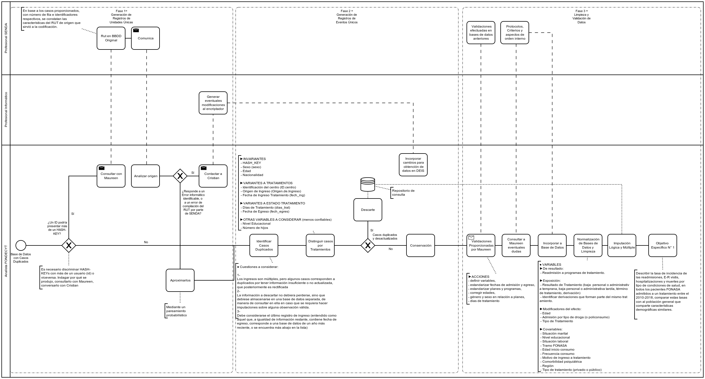

# SISTRAT Datasets

Welcome to the repositories of the construction of the treatment information system (SISTRAT) datasets. On this repository you can find the different processes and actions taken to standardize and prepare the data for the analysis of the investigators of the project.

This page is composed by the following main topics:

0. [Encription of RUTs and generation of HASHs](Encript)
1. [Data preparation and Standardization of C1](Data_prep_C1)
2. [Data preparation and Standardization of TOP or Profile of Treatment Results](top_info.md#include-generated-text)

 

The main processes implied in the preparation of datasets is be presented as follows.

<<<<<<< HEAD
#### Figure 1. Diagram of data preparation

=======
#### Figure 1. Diagram of data preparation 

>>>>>>> 37bcc5b5b899c66ca13613b8d480b30c56e275b5
